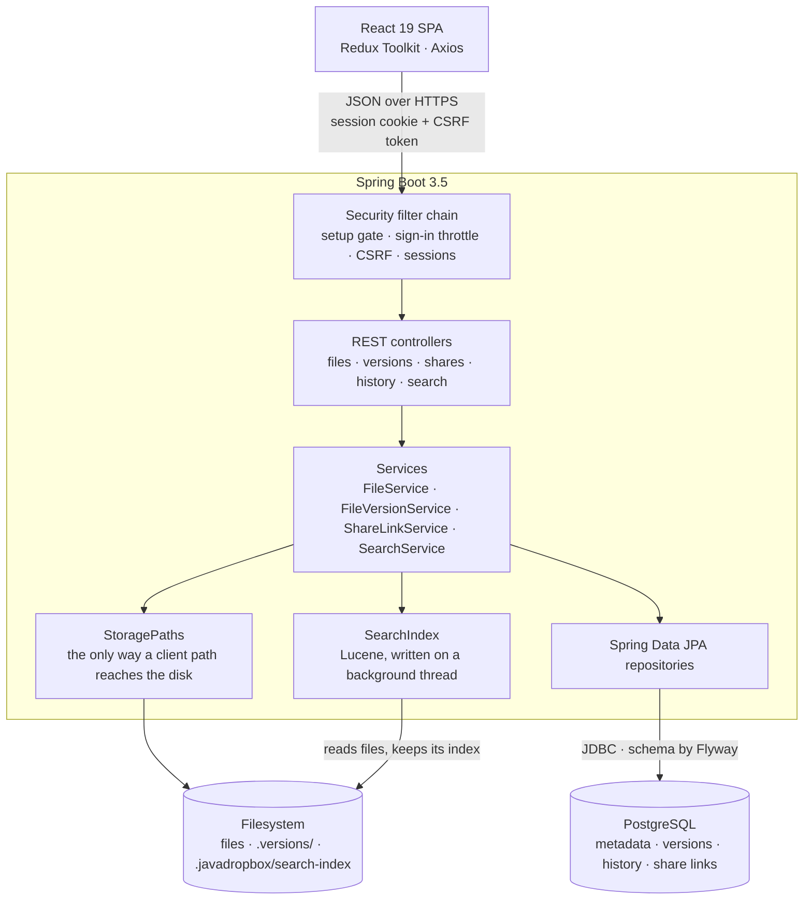
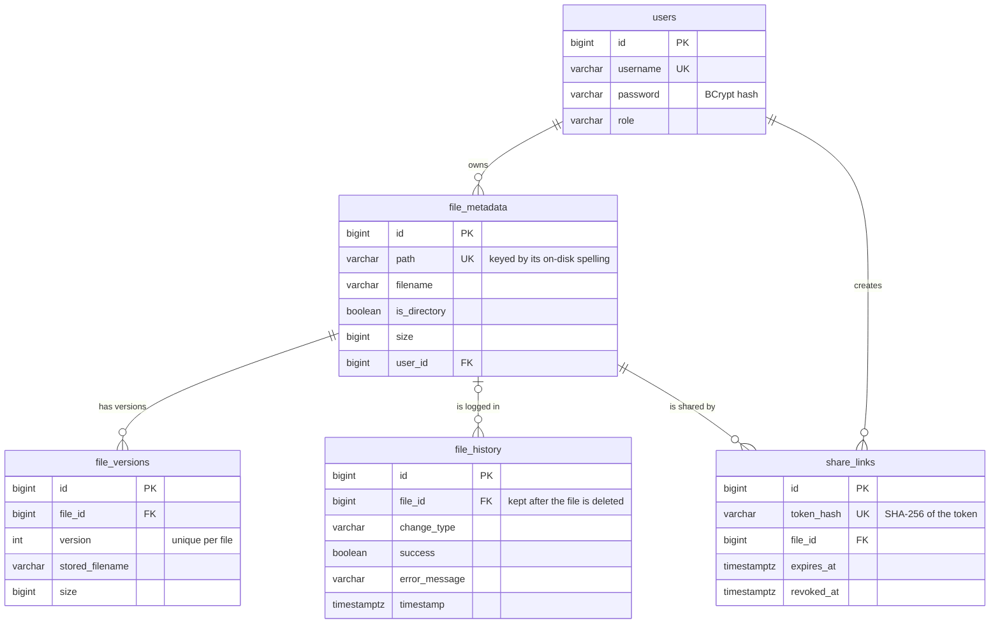
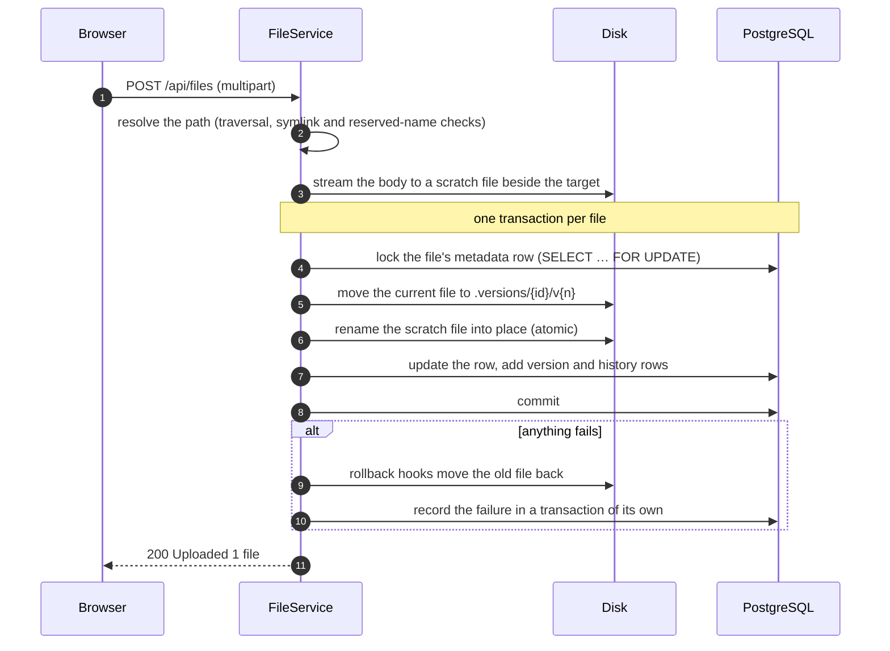
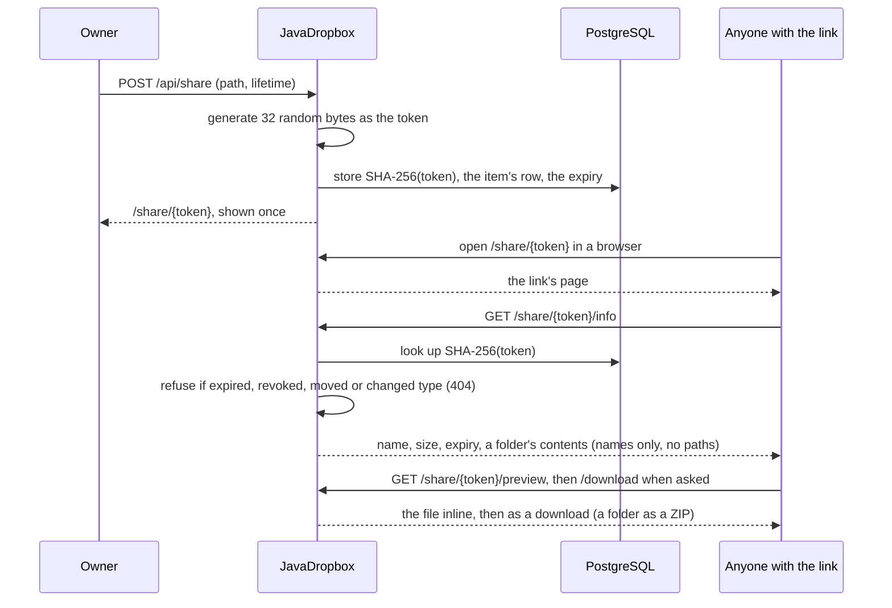
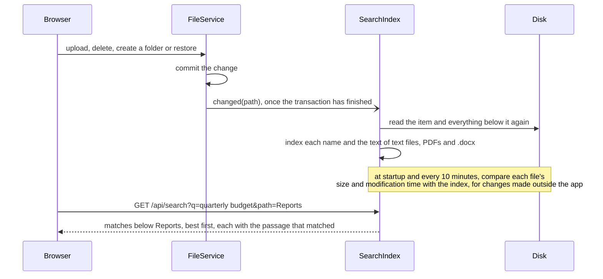
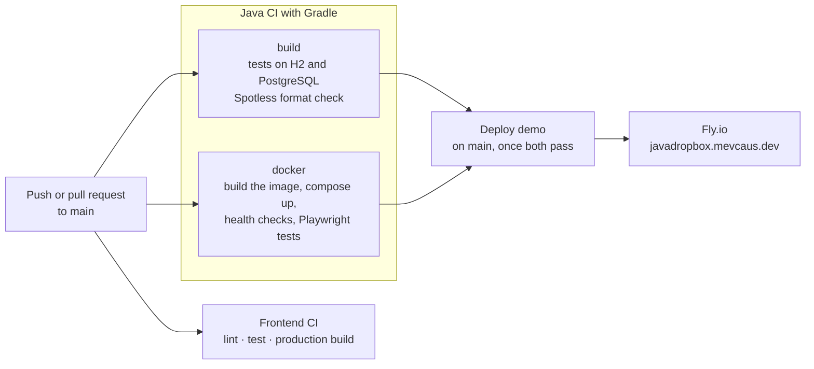

<p align="center">
  
</p>

<p align="center">
  
  
  
  
  
  <a href="https://github.com/mevcaus/JavaDropbox/actions/workflows/gradle.yml"></a>
  <a href="https://github.com/mevcaus/JavaDropbox/actions/workflows/frontend-ci.yml"></a>
</p>

# ☁️ JavaDropbox

A **self-hosted cloud storage platform** built from scratch, inspired by Dropbox and Google Drive. Upload, preview, version, share and restore files through a React dashboard, backed by a Spring Boot REST API, PostgreSQL and the filesystem.

**[Try the live demo →](https://javadropbox.mevcaus.dev)** Sign in as `demo` with the password `javadropbox`. Everyone shares that account, and it is reset every day.

> **Why I built this:** To understand the systems behind cloud storage, from file I/O and streaming ZIP compression to session auth, versioning and safe path handling, by building them myself instead of relying on abstractions.

## Contents

- [Highlights](#highlights)
- [Architecture](#architecture)
- [How it works](#how-it-works)
- [Design decisions](#design-decisions)
- [Features](#features)
- [Tech stack](#tech-stack)
- [Testing and CI/CD](#testing-and-cicd)
- [Live demo](#live-demo)
- [Running it yourself](#running-it-yourself)
- [Roadmap](#roadmap)

## Highlights

- **Crash-safe uploads.** New content is streamed to a scratch file and renamed into place inside a database transaction. If anything fails, rollback hooks put the previous file back on disk, so a failed or dropped upload never leaves a half-written or lost file.
- **File versioning.** Replacing a file keeps the old content as a version that can be restored in place or as a copy, with configurable retention and concurrent replaces serialized by a row lock.
- **Defense against path attacks.** Every client-supplied path goes through one class that rejects `..` traversal, symlinks (rechecked right before each disk operation), reserved folders in any letter case, and hidden names.
- **Revocable share links** that open as a page previewing the file, or listing the folder, before anything is downloaded. Links carry a random 256-bit token; only its SHA-256 hash is stored, so a database leak hands out nothing usable. Links can expire, be revoked, and die with the file they were made for.
- **Streaming downloads.** Folders are zipped straight into the HTTP response, so memory use is flat however big the folder is. Files support range requests for resumable downloads.
- **Full-text search** inside text files, PDFs and Word documents, ranked by relevance with the matching passage highlighted. An embedded Lucene index follows every change on a background thread, and catches up with files changed outside the app.
- **Tested against the real thing.** About 300 backend tests, including concurrency and migration tests on PostgreSQL via Testcontainers and symlink-swap tests, plus about 200 frontend component tests. CI builds and smoke-tests the Docker image, and every merge to `main` deploys the [live demo](https://javadropbox.mevcaus.dev).

## Architecture

The whole app ships as one container: Spring Boot serves the REST API and the built React app. File bytes live on the filesystem; everything about them (metadata, versions, history, share links) lives in PostgreSQL. The search index is a Lucene index on the filesystem too, built from the files and rebuilt from them whenever it has to be.



| Layer | Responsibility | Key classes |
|-------|----------------|-------------|
| **Config** | Security chain, first-run setup gate, sign-in throttling, CORS | `SecurityConfig`, `SetupFilter`, `LoginThrottleFilter`, `SpaFallbackFilter` |
| **Controller** | Routing, HTTP responses and headers, serving the built SPA | `FileController`, `FileVersionController`, `ShareController`, `HistoryController`, `SearchController`, `DownloadResponses`, `ApiExceptionHandler` |
| **Service** | Path validation, file I/O, versioning, audit log, share links, search | `StoragePaths`, `FileService`, `FileVersionService`, `FileHistoryService`, `ShareLinkService`, `FolderArchive`, `SearchIndex`, `TextExtractor` |
| **Repository** | Data access, including pessimistic row locks | `FileMetadataRepository`, `FileVersionRepository`, `FileHistoryRepository`, `ShareLinkRepository` |

### Data model



The schema is owned by six versioned [Flyway](https://documentation.red-gate.com/flyway) migrations; Hibernate only validates that the entities match it.

## How it works

### Uploading over an existing file

The upload is written outside the transaction, so a slow client never holds a database lock. Inside it, every disk change registers an undo that runs if the transaction rolls back.



### Sharing a file



Nothing is downloaded until the visitor asks: a browser opening the link gets a page that previews the file, or lists the folder, next to a Download button. Clients that don't ask for a page, such as `curl` or a download manager, still get the file at the link itself.

### Searching

The disk stays the source of truth: the index only mirrors it, so it can be deleted at any time and is rebuilt from what is stored. One background thread does all the writing, so an upload never waits for a PDF to be read.



Every word has to appear in the item's name or in its text. Case and accents don't matter (`cafe` finds `Café`), and the last word also matches the start of a longer one, so results come up while it is still being typed. A match in the name ranks an item ahead of anything matched by its text alone, and the words appearing together rank a file ahead of the same words scattered through it. Each result is checked against the disk before it is returned, so a file deleted behind the app's back is never offered, and the index is told to drop it.

## Design decisions

### Why a dual storage strategy (filesystem + database)?
Files are stored on the **filesystem** for performance and simplicity (no BLOB overhead), while **metadata, version history, and audit logs** live in PostgreSQL. The database is the source of truth for relationships and history, and the filesystem handles raw bytes. Keeping the two consistent is what the upload flow above is about.

### Why an embedded Lucene index rather than Elasticsearch?
Elasticsearch is Lucene with a cluster around it. Its indexing, BM25 relevance, analyzers and highlighter are Lucene's; what it adds is distribution, with shards and replicas behind a network API that many app servers can share. JavaDropbox runs as one server over one owner's files, which a single Lucene index handles with room to spare. So it uses the engine without the cluster: the same relevance, no network hop between a change and the index, and no second service to deploy, secure, upgrade and back up. That also keeps the app in one container, and the live demo within its 512 MB machine, where Elasticsearch alone would want a gigabyte or more.

Elasticsearch (or OpenSearch) becomes the better choice once the app runs as several servers behind a load balancer: an embedded index belongs to one server, and Lucene over a network filesystem is unreliable. Lucene stays inside `SearchIndex`, whose callers see only paths and snippets, so that move would replace one class rather than the API or the UI ([#222](https://github.com/mevcaus/JavaDropbox/issues/222)).

PostgreSQL's full-text search was the other candidate, but it would put the text of every file into the database, and the tests that run on H2 could not exercise it.

### Why stream ZIPs on the fly?
Folder downloads write a `ZipOutputStream` straight to the HTTP response (`FolderArchive`) rather than building the archive in memory or in a temporary file. Memory use stays flat however large the folder is, and there is nothing to clean up afterwards. The cost is that the size is not known up front, so the response has no `Content-Length`.

### Why a setup filter and a setup code?
Rather than shipping hardcoded credentials, the app detects first-run state (no users in the database) and redirects every request to a setup page. This is a filter inside Spring Security's chain, ahead of form login, so setup is reachable without authentication. Reachable without authentication also means reachable by whoever finds the server first, so creating the account also needs a one-time code that the server prints to its log (the approach Jupyter takes): whoever installed the server can read it, someone who merely found the address cannot.

### Why do previews have their own route?
Downloads are deliberately unable to render: every one is `Content-Disposition: attachment` with `Content-Security-Policy: sandbox`, and no response may be framed. They also serve the public share route. So rather than a flag that relaxes all of that, `GET /api/files/preview` (and `GET /share/{token}/preview`, for a share link's page) serves only an allowlist of types, each with the narrowest headers that still let the browser show it:
- **Text and source files** are always `text/plain`, so an `.html` file shows its markup instead of running it, and `nosniff` stops a disguised file from being sniffed into a page.
- **Images and text** keep the sandbox: an SVG opened on its own runs no script on the app's origin.
- **PDFs** cannot keep it, because browsers' PDF viewers refuse to render a sandboxed document. Instead only the app's own pages may frame them (`frame-ancestors 'self'`), which is how the preview dialog and a share link's page show them.

The list of previewable types lives on the server and reaches the UI through the file tree, so the two cannot disagree about which files open.

### Why server-side share links instead of JWTs?
Share links used to be stateless JWTs naming a path. That avoided a table, but a link could not be withdrawn without changing the signing key (killing every link), its path was readable by anyone holding it, it served whatever was at the path when opened, and the key itself had to be stored somewhere. Storing links as rows with a random token fixes all of that at the cost of one indexed lookup per download, and storing only the token's hash means a database leak does not hand out working links.

### Why Redux Toolkit over React Context?
File operations are async thunks (upload, delete, fetch, create folder). `createAsyncThunk` gives structured side effects with built-in loading and error states, which would take significant boilerplate with Context and `useReducer`.

## Features

**Files**
- Multi-file upload, and whole folders uploaded with their subfolders; folder creation, recursive delete (with the metadata and versions of everything inside)
- Downloads with MIME detection and HTTP range support; folders download as streamed ZIPs
- In-browser previews of images, PDFs and text or source files; text previews fetch only the first 256 KB by range request
- Full-text search across the open folder and everything beneath it, of names and of the text in text and source files, PDFs and Word documents, ranked by relevance with the matching words highlighted in a passage of each file
- Sortable columns, and the open folder kept in the URL

**Versions and history**
- Every replace keeps the previous content; restore any version in place or as a copy (`report_v2.txt`)
- Configurable retention, with older versions pruned on upload
- An audit log of every upload, delete, folder creation and restore, including failures, which are recorded even though the operation rolled back
- On startup, leftovers from a crash (scratch files, orphaned versions) are cleaned up, with safeguards so starting against the wrong database can't delete version history

**Security**
- Spring Security form login with sessions, BCrypt passwords and cookie-based CSRF protection
- Sign-in throttling: five failures from one address lock it out for 15 minutes (`429` with `Retry-After`), using the real client address behind a trusted reverse proxy
- Path safety, as above; paths are keyed by their on-disk spelling, so case variants on macOS or Windows share one record
- Optional caps on upload size, total storage (versions included) and share-link lifetime

**Frontend**
- React 19 single-page app with Redux Toolkit, Tailwind CSS and responsive layout
- Accessible dialogs (focus trap and restore, Escape to close), keyboard-operable sorting with `aria-sort`, errors announced to screen readers

**Operations**
- One Docker image with the frontend bundled into the backend, plus Docker Compose with PostgreSQL
- Health and usage metrics through Spring Boot Actuator, and an OpenAPI spec with Swagger UI in development

## Tech stack

| Layer | Technology |
|-------|-----------|
| **Backend** | Java 21, Spring Boot 3.5, Spring Security 6, Spring Data JPA / Hibernate |
| **Database** | PostgreSQL, Flyway migrations |
| **Search** | Apache Lucene (embedded), Apache PDFBox for the text of PDFs |
| **Frontend** | React 19, Vite, Redux Toolkit, Axios, Tailwind CSS, Lucide icons |
| **Testing** | JUnit 5, MockMvc, Testcontainers, H2, Jimfs; Vitest, Testing Library |
| **Build and style** | Gradle, Spotless with google-java-format, ESLint |
| **Delivery** | Docker (multi-stage build), Docker Compose, GitHub Actions, Fly.io |

## Testing and CI/CD

Most backend tests are Spring Boot integration tests that drive the real HTTP API through MockMvc on an in-memory database. The ones where the database matters run on **PostgreSQL in Testcontainers**: concurrent replaces and deletes of one file, every Flyway migration, and the first-run setup. A few run on a real Tomcat to cover what MockMvc can't, such as cancelled downloads and trusted proxy headers. Filesystem edge cases (case-insensitive filesystems, symlinks swapped in between a check and its use) run on real disks and on Jimfs. Frontend tests render real components and drive them with real user events. **End-to-end tests** in Playwright then drive the real app in Chromium against the Docker Compose stack, frontend, backend and PostgreSQL together, on every pull request: first-run setup, signing in and out, uploads of files and whole folders, previews, downloads, searching inside files, share links opened signed out and revoked, restoring versions, and deletes. [docs/testing.md](docs/testing.md) lists what every suite covers and how to run them.



## Live demo

[javadropbox.mevcaus.dev](https://javadropbox.mevcaus.dev) is the same Docker image, deployed to [Fly.io](https://fly.io) with a [Neon](https://neon.tech) PostgreSQL database every time a merge to `main` passes CI. A `demo` Spring profile makes it safe to leave open to the public:

- **No setup.** The shared account is created at startup, and the sign-in page offers to fill it in.
- **A daily reset.** Every file, version, share link and history entry is deleted, and a few sample files are stored again, including one with versions to restore. Fly suspends the server while nobody is using it, and a scheduled job can't run during a suspend, so the reset runs on the first request after it falls due, before that request is handled.
- **Small limits**, so it can't be used as free file hosting: 5 MB per file, 50 MB in total (previous versions included), and share links that last at most 15 minutes.

## Running it yourself

```bash
git clone https://github.com/mevcaus/JavaDropbox.git
cd JavaDropbox
docker compose --profile app up --build
```

Then open `http://localhost:8080` and create the first account with the setup code from `docker compose logs app`.

- **[Self-hosting](docs/self-hosting.md):** first-run setup, configuration, reverse proxies, password recovery, health and metrics
- **[Development](docs/development.md):** running from source with hot reload, project structure, database migrations, code style
- **[Testing](docs/testing.md):** what each backend, frontend and end-to-end test suite covers
- **[API reference](docs/api.md):** every endpoint, with Swagger UI available in development

## Roadmap

- [x] **File previews** for images, PDFs and text files
- [x] **Live demo** deployed on every merge
- [x] **Full-text search** across file contents and metadata on the server
- [x] **Folder upload** of whole directory structures
- [ ] **Multi-user support** with role-based access and per-user quotas
- [ ] **S3-compatible storage backend**
- [ ] **Desktop sync client** that keeps a local folder in sync

## License

MIT. See [LICENSE](LICENSE).
